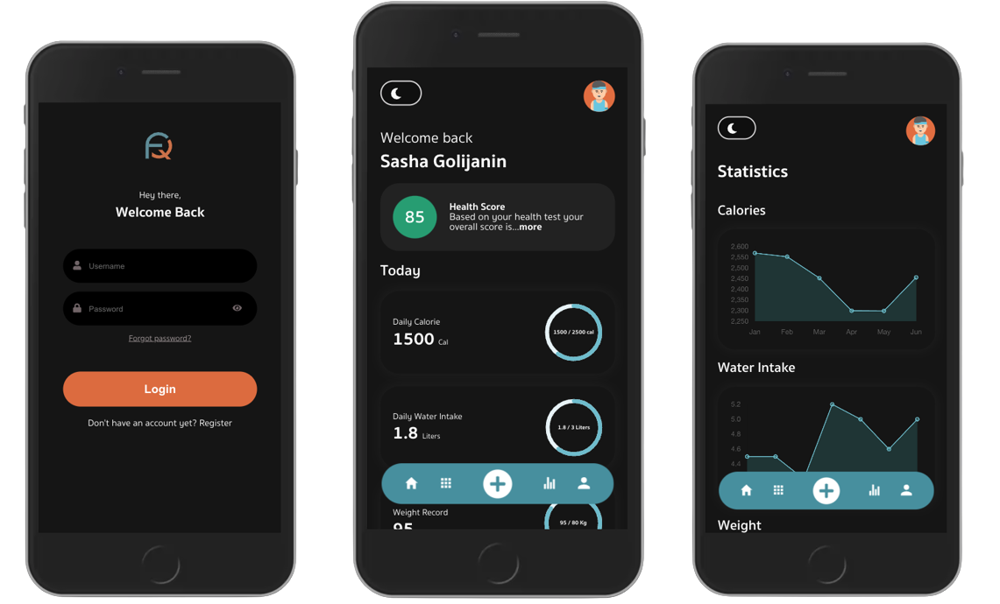

# FiTraQ - Fit Tracking Application



## Content
- [Overview](#overview)
- [Motivation](#motivation)
- [Features](#features)
- [Getting Started](#getting-started)
  - [Prerequisites](#prerequisites)
  - [Installation](#installation)
- [Usage](#usage)
- [Contributing](#contributing)
- [License](#license)

## Overview

FiTraQ is a user-friendly health and fitness tracking application designed to help users achieve their health and wellness goals. With its intuitive interface and comprehensive feature set, FiTraQ provides a seamless experience for tracking workouts, monitoring calorie intake, and managing hydration.

## Motivation

Existing fitness apps often lack user-friendly interfaces, hindering user engagement. FiTraQ was born out of the need for an accessible and efficient fitness tracking solution that empowers users to take control of their health journey.

## Features

- Track daily workouts and exercises.
- Monitor calorie consumption and set personalized goals.
- Keep hydration levels in check by tracking water intake.
- User-friendly interface for a seamless experience.
- Integration of React, Redux, Django, and DjangoREST for enhanced functionality.

## Getting Started

### Prerequisites

- Node.js and npm (for the frontend).
- Python and Conda (for the backend).

### Installation

1. Clone the repository:
   
   ```sh
   git clone https://github.com/5aleG/fitraq.git
   cd fitraq

3. Frontend
   
    ```sh
    cd frontend
    npm install
    npm start
    ```
   This will start the development server for the frontend application.


3. Backend
   
    ```sh
    cd backend
    conda env create -f requirements.yml
    python manage.py makemigrations
    python manage.py migrate
    python manage.py createsuperuser
    python manage.py runserver 0:8001
    ```
    This will set up and start the backend development server.


4. Visit:
    ```
    http://localhost:8001/backend/api/v1/admin/
    ```
    To access the admin panel. Create a user profile for testing purposes.


### Usage
FiTraQ is a work in progress, and contributions are welcome. Feel free to explore the code, test the application, and provide feedback or feature suggestions.

### Contributing
Contributions are appreciated! Whether you want to report a bug, suggest improvements, or contribute code.
 
### License
This project is licensed under the [MIT License](https://opensource.org/licenses/MIT).
