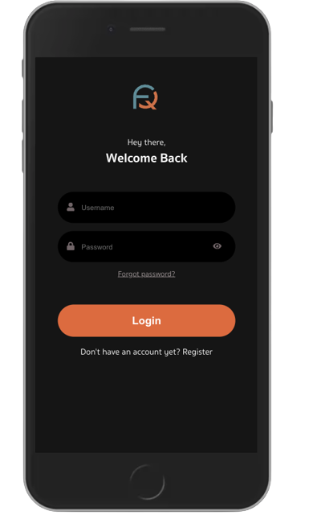
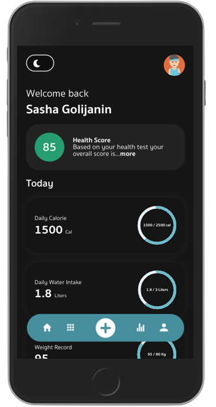
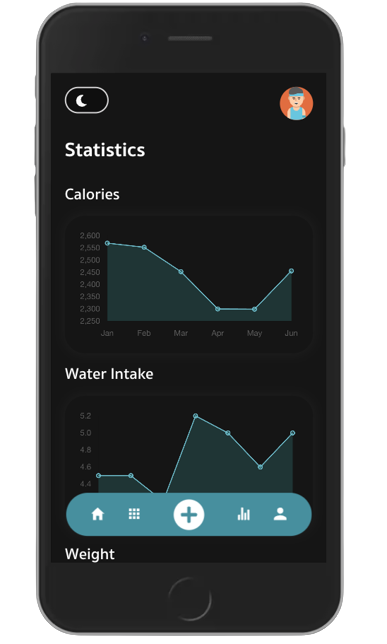

# FiTraQ - Fitness Tracker Application

## Description

FiTraQ is a versatile fitness tracker application designed to help users of all backgrounds and fitness levels achieve their health and wellness goals. It provides a comprehensive set of features to track workouts, set goals, and monitor progress, all in an intuitive and user-friendly interface.

## Motivation

Many existing fitness tracking apps are complicated to use, leading to user frustration. FiTraQ was developed to address this issue by offering an easy-to-use solution for tracking calories and water intake. This project was also a valuable opportunity for skill development and practice.

## Technologies Used

- React
- Redux
- Styled Components
- Django
- DjangoREST
- SimpleJWT

## Installation

### Frontend

1. Download or clone the repository.
2. Navigate to the frontend directory: `cd frontend`
3. Install dependencies: `npm install`
4. Start the development server: `npm start`

### Backend

1. Ensure you have Conda installed.
2. In the project's root directory, create the environment: `conda env create -f requirements.yml`
3. Apply migrations: `python manage.py makemigrations` and `python manage.py migrate`
4. Create a superuser: `python manage.py createsuperuser`
5. Start the development server: `python manage.py runserver 0:8001`
6. Visit `localhost:8001` to access the admin panel. Create a user profile for testing purposes.

## Usage

Please note that FiTraQ is still under development. Contributions and collaborations are welcome to improve and expand its functionality.

---

For more details and to contribute, please visit the [GitHub repository](https://github.com/5aleG/fitraq).
